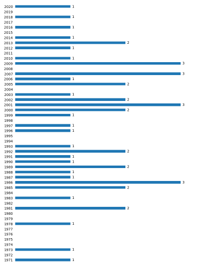

# Prison Breaks Analysis

## Overview

This project explores prison breaks involving helicopters with the aim of analyzing trends and patterns in the data. The dataset used for this analysis is obtained from the [Wikipedia Article](https://en.wikipedia.org/wiki/List_of_helicopter_prison_escapes#Actual_attempts) on helicopter prison escapes. The analysis is conducted using Python and Jupyter Notebook and is based on a Dataquest activity.

## Examples of Use

### Motivation

This project serves as a demonstration of basic data science skills, showcasing the ability to collect, clean, and analyze real-world data using Python and Jupyter Notebook.

### Value Proposition

- **Data Collection and Preparation**: Gain experience in obtaining data from online sources, parsing it, and preparing it for analysis.
- **Data Analysis**: Explore foundational data analysis techniques, such as descriptive statistics and data visualization, to derive insights from the dataset.
- **Python Programming**: Practice Python programming skills by implementing data manipulation, analysis, and visualization tasks.
- **Jupyter Notebook Usage**: Familiarize with Jupyter Notebook as a tool for interactive data exploration and analysis.

## Installation and Setup

To run this project locally or contribute to it, follow these steps:

1. **Clone the Repository:**

   ```
   git clone https://github.com/aguiarth/prison-breaks.git
   cd prison-breaks
   ```

2. **Install Dependencies:**
   Ensure you have Python installed on your system. Additionally, install the required Python packages using pip:

   ```
   pip install -r requirements.txt
   ```

3. **Run the Jupyter Notebook:**

   ```
   jupyter notebook
   ```

   Open the `prison_breaks.ipynb` notebook in your browser and follow the instructions to execute the code and analyze the data.

## Questions Explored

This analysis aims to answer the following questions:

- In which year did the most helicopter prison break attempts occur?
- In which countries do the most attempted helicopter prison breaks occur?

## Results

The analysis revealed the following insights:

| Country         | Number of Occurrences |
|-----------------|-----------------------|
| France          | 15                    |
| United States   | 8                     |
| Belgium         | 4                     |
| Canada          | 4                     |
| Greece          | 4                     |
| Australia       | 2                     |
| Brazil          | 2                     |
| United Kingdom  | 2                     |
| Mexico          | 1                     |
| Ireland         | 1                     |
| Italy           | 1                     |
| Puerto Rico     | 1                     |
| Chile           | 1                     |
| Netherlands     | 1                     |
| Russia          | 1                     |

These results indicate that France has the highest number of attempted helicopter prison breaks.

Attempts per year:



## Contributing

Contributions to this project are welcome! If you have any suggestions, bug fixes, or additional analyses you'd like to contribute, please submit a pull request.

## Info

This project is licensed under the [MIT License](LICENSE).

Thaís Aguiar - [GitHub](https://github.com/aguiarth) | [LinkedIn](https://www.linkedin.com/in/aguiarth) | [Twitter](https://twitter.com/aguiarth)

---
